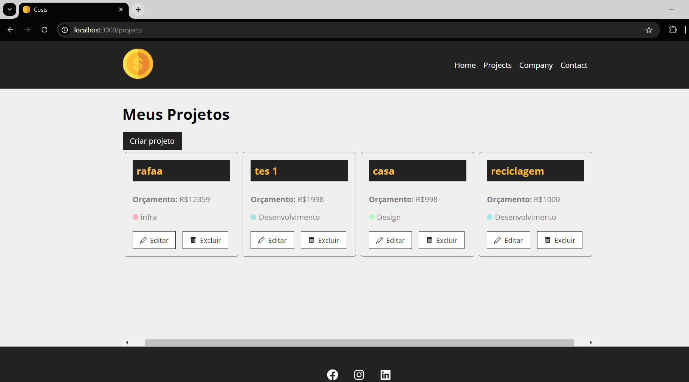

# sistema-costs

Start the project with the following command in the terminal:

cd costs
npm start

Open another terminal in the project to start the database locally:

cd costs
npm run backend --watch db.json --port 5000

After that, your project will start.

Home Page
</img>

Projects Page
</img>

Project Edit Page
</img>

Service Addition Page
</img>

Service Edit Page
</img>

This project was created for study purposes and includes the integration of a local database, using the CRUD methodology for creating, reading, updating, and deleting services added to the project.

It also features warning messages throughout the code to make the site intuitive and to show that the services have been updated.

